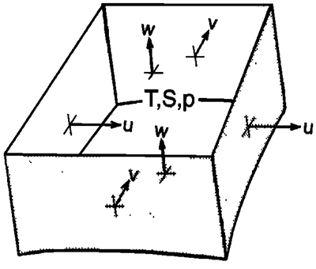

# Numerical algorithm

Here we present notes on the governing equations, spatial discretization schemes, time-stepping algorithms, and elliptic equation solvers for Oceananigans.jl.
Both hydrostatic (HY) and non-hydrostatic (NHY) algorithms are presented, although the model can only be run in non-hydrostatic mode right now.

## Grids and variables

Lay out a Cartesian array $(x,y,z)$ of cubes of horizontal dimensions $\Delta x, \Delta y$ and vertical dimension $\Delta z$ as in the figure below.
Define the areas of the cell faces as $A_x = \Delta y \Delta z$, $A_y = \Delta x \Delta z$, and $A_z = \Delta x \Delta y$.
Each cell encloses a volume $V = \Delta x \Delta y \Delta z$.
Velocities $(u,v,w) = (v_x, v_y, v_z)$ are normal to the requisite face, that is, they are defined on the faces of the cells.

  

Tracer variables, which are cell averages, are temperature $T$ and salinity $S$ and thus are stored at the cell centers.
Pressure $p$ and density $\rho$ are also defined at the cell centers.
The faces of the cells are coincident with three orthogonal coordinate axes (Cartesian in this case).
Vorticity $\mathbf{\omega}=\v{\nabla}\times\mathbf{u}$ and certain intermediate quantities are stored at the cell edges.
(In 2D it would more correct to say the cell corners, however, in 3D variables like vorticity $\mathbf{\omega}$ lie
at the same vertical levels as the cell-centered variables and so they really lie at the cell edges.
In addition to being technically correct, we abbreviate cell centers as $c$ and cell faces as $f$ in subscripts, so edges can use $e$ while corners would conflict with cell centers.)

The cells are indexed by $(i,j,k)$ where $i\in \{1,2,\dots,N_x\}$, $j\in \{1,2,\dots,N_y\}$, and $k\in \{1,2,\dots,N_z\}$ with $k=1$ corresponding to the top and $k=N_z$ corresponding to the bottom.
(To solve the equations on the sphere, the "quads" used to grid the sphere are appropriately defined including geometrical information and the $G$'s in the equations have to be modified slightly to include metric terms.
But the underlying algorithm remains the same.)

While there are $N$ cells and cells centers per dimension and $N+1$ cell faces and cell edges per dimension, all fields are stored as $N_x \times N_y \times N_z$ fields.
The reason for this is that for the case of periodic boundary conditions, the values at face $N+1$ equal the values at face $1$ so there is no need to store an extra face, and for walled boundaries, faces $N+1$ and $1$ both represent walls so again there is no need to store an extra face. This will change for the case of open boundary conditions which are not considered here.

## Governing prognostic equations and boundary conditions

The governing equations are the rotating, incompressible, Boussinesq equations of motion.
They are an approximation to the full Navier-Stokes equations in a non-intertial reference frame that is appropriate for the ocean and may be written as:

```math
\newcommand\p[2]{\frac{\partial #1}{\partial #2}}
\newcommand\v[1]{\boldsymbol{ #1}}
\begin{equation}
  \p{\mathbf{v}_h}{t} = \mathbf{G}_{vh} - \v{\nabla}_h p ,
  \label{eqn:horizontalMomentum}
\end{equation}
```

```math
\begin{equation}
  \p{w}{t} = G_w - \p{p}{z} ,
  \label{eqn:verticalMomentum}
\end{equation}
```

```math
\begin{equation}
  \v{\nabla} \cdot \mathbf{v} = 0 ,
  \label{eqn:continuity}
\end{equation}
```

```math
\begin{equation}
  \p{T}{t} = G_T ,
  \label{eqn:TTendency}
\end{equation}
```

```math
\begin{equation}
  \p{S}{t} = G_S ,
  \label{eqn:STendency}
\end{equation}
```

```math
\begin{equation}
  \rho = \rho(T,S,p) ,
  \label{eqn:EOS}
\end{equation}
```

where $\mathbf{v} = (\mathbf{v}_h, w) = (u, v, w)$ is the velocity, $\mathbf{v}_h = (u,v)$ is the horizontal velocity, $\v{\nabla} = (\partial_x, \partial_y, \partial_z)$ is the del operator, and $\v{\nabla}_h = (\partial_x, \partial_y)$ is the horizontal del operator. Equations \eqref{eqn:horizontalMomentum} and \eqref{eqn:verticalMomentum} are the horizontal and vertical momentum equations respectively. Equation \eqref{eqn:continuity} is the continuity equation expressing conservation of mass. Equations \eqref{eqn:TTendency} and \eqref{eqn:STendency} prognostic equations describing the time evolution of temperature~$T$ and salinity~$S$. Equation \eqref{eqn:EOS} is an equation of state for seawater giving the density $\rho$ in terms of $T$, $S$, and $p$. The source terms $\mathbf{G}_v = (\mathbf{G}_{vh}, G_w) = (G_u, G_v, G_w)$ represents inertial, Coriolis, gravitational, forcing, and dissipation terms. They can be written as

```math
\begin{align}
    G_u &= -\mathbf{v} \cdot \v{\nabla} u + fv - \frac{1}{\rho_0} \p{p'_{HY}}{x} + \v{\nabla}\cdotp (\nu\v{\nabla} u) + F_u  ,\\
    G_v &= -\mathbf{v} \cdot \v{\nabla} v - fu - \frac{1}{\rho_0} \p{p'_{HY}}{y} + \v{\nabla}\cdotp (\nu\v{\nabla} v) + F_v  ,\\
    G_w &= -\mathbf{v} \cdot \v{\nabla} w - \nabla\cdotp (\nu\nabla w) + F_w ,
\end{align}
```

where $f = 2\Omega\sin\phi$ is the Coriolis frequency, $\Omega$ is the rotation rate of the Earth, $\phi$ is the latitude, $g$ is the acceleration due to gravity, $p'_{HY}$ is the hydrostatic pressure anomaly, $\rho_0$ is a reference density corresponding to an ocean at rest, and $\nu$ is the viscosity. $F_u$, $F_v$, and $F_w$ represent other forcing terms that may be imposed. Note that the buoyancy term $-g(\delta\rho/\rho_0)$ that is usually present in the vertical momentum equation has been expressed in terms of the hydrostatic pressure anomaly $p'_{HY}$ which ends up in the horizontal momentum equations. (This step will be shown in an appendix.)

Similarly, the source terms for the tracer quantities can be written as

```math
\begin{equation}
  G_T = -\v{\nabla} \cdot (\mathbf{v} T) + \kappa\nabla^2 T + F_T ,
  \label{eqn:G_T}
\end{equation}
```

```math
\begin{equation}
  G_S = -\v{\nabla} \cdot (\mathbf{v} S) + \kappa\nabla^2 S + F_S ,
  \label{eqn:G_S}
\end{equation}
```

where $\kappa$ is the diffusivity while $F_T$ and $F_S$ represent forcing terms.

The associated boundary conditions for the embedded non-hydrostatic models is periodic in the horizontal direction and a rigid boundary or "lid" at the top and bottom. The rigid lid approximation sets $w = 0$ at the vertical boundaries so that it does not move but still allows a pressure to be exerted on the fluid by the lid.

## Numerical strategy

To numerically solve the governing equations, they must be appropriately discretized. To this effect a number of strategies are employed to ensure the discretized equations satisfy the same conservative properties that the incompressible Navier-Stokes equations satisfy, and to ensure that the numerical solution is stable.

The main strategies involve the use of a staggered grid and the splitting of the pressure field into three components.

### Staggered grid

As shown in the schematic of a single volume and discussed earlier the velocities are defined as averages over faces while other quantities are cell averages stored at the cell centers. This staggered storage of variables is more complicated than the collocated grid arrangement but is massively beneficial as it avoids the odd-even decoupling between the pressure and velocity if they are stored at the same positions. Odd-even decoupling is a discretization error that can occur on collocated grids and which leads to checkerboard patterns in the solutions (See the CFD Online article on [staggered grids](https://www.cfd-online.com/Wiki/Staggered_grid)). Another way to look at this is that the discrete Poisson equation used to enforce incompressibility has a null space. The null space often manifests itself in producing solutions with checkerboard pressure fields. The staggering of variables effectively eliminates the null space; however, when it is used in the context of curvilinear coordinates its consistent implementation is complicated because it requires the use of contravariant velocity components and variable coordinate base vectors [See A. S. Dvinsky & J. K. Dukowicz, [Null-space-free methods for the incompressible Navier-Stokes equations on non-staggered curvilinear grids](https://www-sciencedirect-com.libproxy.mit.edu/science/article/pii/0045793093900336), _Computers & Fluids_ **22**(6), pp. 685--696 (1993)].

### Splitting of the pressure field

Another strategy employed is to split the pressure field into three components
```math
\begin{equation} \label{eqn:pressure_split}
    p(x,y,z) = p_S(x,y) + p_{HY}(x,y,z) + qp_{NH}(x,y,z ,
\end{equation}
```
where the first term, $p_S$, is the surface pressure---the pressure exerted by the fluid under the rigid lid at the surface; it is only a function of horizontal position and is found by inverting a 2D elliptic Poisson equation. The second term is the hydrostatic pressure $p_{HY}$ defined in terms of the weight of water in a vertical column above the depth $z$
```math
\begin{equation} \label{eqn:hydrostaticPressure}
    \p{p_{HY}}{z} + g' = 0 ,
\end{equation}
```
where $g' = g(\delta \rho / \rho_0)$ is the _reduced gravity_. The third term is the non-hydrostatic pressure $p_{NH}$ which must be found by inverting a 3D elliptic equation analogous to \eqref{eqn:ellipticPressure}. Note that the parameter $q$ in, for example, \eqref{eqn:pressure_split}, is a trace parameter that is set to zero in HY and to one in the NHY algorithm. The methods we use to solve for the various components of the pressure field will be described in the next section.

A related quantity, the geopotential $\phi = p / \rho_0$ is used as required.

## Discrete operators

To calculate the various terms and perform the time-stepping, discrete difference and interpolation operators must be designed from which all the terms, such as momentum advection and Laplacian diffusion, may be constructed. These operators introduced in this section are for a Cartesian grid with periodic boundary conditions in the horizontal and a rigid lid at the top and bottom. The operators will change form for other grids such as the cubed sphere.

### Difference operators

Difference operators act as the discrete form of the derivative operators. Care must be taken when calculating differences as the difference of a cell-centered variable such as temperature $T$ lies on the faces in the direction of the difference, and vice versa. In principle, there are three difference operators, one for each direction

```math
\begin{equation}
  \delta_x f = f_E - f_W ,
  \label{eqn:delta_x}
\end{equation}
```

```math
\begin{equation}
  \delta_y f = f_N - f_S ,
  \label{eqn:delta_y}
\end{equation}
```

```math
\begin{equation}
  \delta_z f = f_T - f_B ,
  \label{eqn:delta_z}
\end{equation}
```

where the $E$ and $W$ subscripts indicate that the value is evaluated the eastern or western wall of the cell, $N$ and $S$ indicate the northern and southern walls, and $T$ and $B$ indicate the top and bottom walls.

Additionally, three $\delta$ operators must be defined for each direction to account for the staggered nature of the grid. One for taking the difference of a cell-centered variable and projecting it onto the cell faces
```math
\begin{align}
    \delta_x^{c \rightarrow f} f_{i,j,k} &= f_{i,j,k} - f_{i-1,j,k} , \\
    \delta_y^{c \rightarrow f} f_{i,j,k} &= f_{i,j,k} - f_{i,j-1,k} , \\
    \delta_z^{c \rightarrow f} f_{i,j,k} &= f_{i,j,k} - f_{i,j,k-1} ,
\end{align}
```
and another for taking the difference of a face-centered variable and projecting it onto the cell centers
```math
\begin{align}
    \delta_x^{f \rightarrow c} f_{i,j,k} &= f_{i+1,j,k} - f_{i,j,k} , \\
    \delta_y^{f \rightarrow c} f_{i,j,k} &= f_{i,j+1,k} - f_{i,j,k} , \\
    \delta_z^{f \rightarrow c} f_{i,j,k} &= f_{i,j,k+1} - f_{i,j,k} .
\end{align}
```
The third $\delta$ operator of use is the one that takes the difference of an edge-centered variable and projects it onto the cell faces, $\delta^{e \rightarrow f}$, which looks the same as $\delta^{f \rightarrow c}$. While it is computationally redundant, it is included for clarity.

The horizontal difference operators, $\delta_x$ and $\delta_y$, take into account the periodic boundary conditions while the vertical difference operator $\delta_z$ must take into account the rigid lid. In the vertical this is done by imposing that $\delta_z^{c \rightarrow f}f_{i,j,1} = f_{i,j,1}$ and $\delta_z^{f \rightarrow c}f_{i,j,N_z} = f_{i,j,N_z}$.

### Interpolation operators
In order to add or multiply variables that are defined at different points they are interpolated. In our case, linear interpolation or averaging is employed. Once again, there are three averaging operators, one for each direction,

```math
\begin{equation}
  \overline{f}^x = \frac{f_E + f_W}{2} ,
  \label{eqn:avg_x}
\end{equation}
```

```math
\begin{equation}
  \overline{f}^y = \frac{f_N + f_S}{2} ,
  \label{eqn:avg_y}
\end{equation}
```

```math
\begin{equation}
  \overline{f}^z = \frac{f_T + f_B}{2} .
  \label{eqn:avg_z}
\end{equation}
```

Additionally, three averaging operators must be defined for each direction. One for taking the average of a cell-centered variable and projecting it onto the cell faces
```math
\begin{align}
    \overline{f_{i,j,k}}^{x,c \rightarrow f} = \frac{f_{i,j,k} + f_{i-1,j,k}}{2} , \\
    \overline{f_{i,j,k}}^{y,c \rightarrow f} = \frac{f_{i,j,k} + f_{i,j-1,k}}{2} , \\
    \overline{f_{i,j,k}}^{z,c \rightarrow f} = \frac{f_{i,j,k} + f_{i,j,k-1}}{2} ,
\end{align}
```
and another for taking the average of a face-centered variable and projecting it onto the cell centers
```math
\begin{align}
    \overline{f_{i,j,k}}^{x,f \rightarrow c} = \frac{f_{i+1,j,k} + f_{i,j,k}}{2} , \\
    \overline{f_{i,j,k}}^{y,f \rightarrow c} = \frac{f_{i,j+1,k} + f_{i,j,k}}{2} , \\
    \overline{f_{i,j,k}}^{z,f \rightarrow c} = \frac{f_{i,j,k+1} + f_{i,j,k}}{2} .
\end{align}
```
The third averaging operator of use is the one that takes the difference of a face-centered variable and projects it onto the cell edges, $\overline{f}^{f \rightarrow e}$, which is the same as $\delta^{c \rightarrow f}$.

The horizontal averaging operators take into account the periodic boundary conditions while the vertical averaging operator takes in to account the presence of the rigid lid.

### Divergence and flux divergence operators

The divergence of the flux of a cell-centered quantity over the cell can be calculated as
```math
\begin{equation}
    \v{\nabla} \cdot \mathbf{f} = \frac{1}{V} \left[ \delta_x^{c \rightarrow f} (A_x f_x)  + \delta_y^{c \rightarrow f} (A_y f_y) + \delta_z^{c \rightarrow f} (A_z f_z) \right] ,
\end{equation}
```
where $\mathbf{f} = (f_x, f_y, f_z)$ is the flux with components defined normal to the faces, and $V$ is the volume of the cell. The presence of a solid boundary is indicated by setting the appropriate flux normal to the boundary to zero. In our case, we have already done this in the definition of the $\delta$ operators. A similar divergence operator can be defined for a face-centered quantity.

The divergence of the flux of $T$ over a cell, $\v{\nabla} \cdot (\mathbf{v} T)$, required in the evaluation of $G_T$, for example, is then
```math
\begin{equation}
    \v{\nabla} \cdot (\mathbf{v} T) = \frac{1}{V} \left[ \delta_x^{f \rightarrow c} (A_x u \overline{T}^x) + \delta_y^{f \rightarrow c} (A_y v \overline{T}^y) + \delta_z^{f \rightarrow c} (A_z w \overline{T}^z) \right]
\end{equation}
```
where $T$ is interpolated onto the cell faces where it can be multiplied by the velocities, which are then differenced and projected onto the cell centers where they added together and then added to $G_T$ which also lives at the cell centers.

### Momentum advection operators

The advection terms that make up the $\mathbf{G}$ terms in equations \eqref{eqn:horizontalMomentum} and \eqref{eqn:verticalMomentum} can be mathematically written as
```math
\begin{equation}
    \mathbf{u} \cdot \v{\nabla} v
    = \v{\nabla} \cdot (v\mathbf{u}) - v\underbrace{(\v{\nabla}\cdot\mathbf{u})}_{=0}
    = \v{\nabla} \cdot (v\mathbf{u}) ,
\end{equation}
```
which can then be discretized similarly to the flux divergence operator, however, they must be discretized differently for each direction.

For example, the $x$-momentum advection operator is discretized as
```math
\begin{equation}
    \mathbf{u} \cdot \v{\nabla} u
    = \frac{1}{\overline{V}^x} \left[
      \delta_x^{c \rightarrow f} \left( \overline{A_x u}^{x, f \rightarrow c} \overline{u}^{x, f \rightarrow c} \right)
      + \delta_y^{e \rightarrow f} \left( \overline{A_y v}^{x, f \rightarrow e} \overline{u}^{y, f \rightarrow e} \right)
      + \delta_z^{e \rightarrow f} \left( \overline{A_z w}^{x, f \rightarrow e} \overline{u}^{z, f \rightarrow e} \right) \right] ,
\end{equation}
```
where $\overline{V}^x$ is the average of the volumes of the cells on either side of the face in question. Calculating $\partial(uu)/\partial x$ can be performed by interpolating $A_x u$ and $u$ onto the cell centers then multiplying them and differencing them back onto the faces. However, in the case of the the two other terms, $\partial(vu)/\partial y$ and $\partial(wu)/\partial z$, the two variables must be interpolated onto the cell edges to be multiplied then differenced back onto the cell faces.

### Laplacian diffusion operator

Laplacian diffusion is discretized for tracer quantities as
```math
\begin{equation}
    \v{\nabla} \cdot (\kappa \v{\nabla} T)
    = \frac{1}{V} \left[
        \delta_x^{f \rightarrow c} \left( \kappa_h A_x \delta_x^{c \rightarrow f} T \right)
      + \delta_y^{f \rightarrow c} \left( \kappa_h A_y \delta_y^{c \rightarrow f} T \right)
      + \delta_z^{f \rightarrow c} \left( \kappa_v A_z \delta_z^{c \rightarrow f} T \right)
    \right] ,
\end{equation}
```
where $\kappa$ is the diffusivity, usually taken to be the eddy diffusivity, and different diffusivities may be taken for the horizontal and vertical directions to account for the differences between horizontal and vertical turbulence.

### Viscous terms

Viscous dissipation operators are discretized similarly to the momentum advection operators and so there is a different one for each direction. For example, the vertical diffusion operator is discretized as
```math
\begin{multline}
    \v{\nabla} \cdot (\nu \v{\nabla} w)
    = \frac{1}{V} \left[
        \delta_x^{e \rightarrow f} \left( \nu_h \overline{A_x}^{x,f \rightarrow e} \delta_x^{f \rightarrow e} u \right)
        \delta_y^{e \rightarrow f} \left( \nu_h \overline{A_y}^{y,f \rightarrow e} \delta_y^{f \rightarrow e} v \right) \nonumber \\
        \delta_z^{c \rightarrow f} \left( \nu_v \overline{A_z}^{z,f \rightarrow c} \delta_z^{f \rightarrow c} w \right)
    \right] ,
\end{multline}
```
where $\nu$ is the eddy viscosity.

[Need notes on boundary conditions.]

## Time stepping

Once the source terms are calculated, the time stepping is performed as follows where superscripts indicate the time-step:
```math
\begin{equation}
  \frac{\mathbf{u}^{n+1} - \mathbf{u}^n}{\Delta t} = \mathbf{G}_{\mathbf{u}}^{n+1/2} - \v{\nabla} (\phi_S + \phi_{HY} + q\phi_{NH})^{n+1/2} ,
  \label{eqn:velocity_time_stepping}
\end{equation}
```

```math
\begin{equation}
    \frac{1}{\Delta t} \left[ \begin{pmatrix}S \\ T\end{pmatrix}^{n+1} - \begin{pmatrix}S \\ T\end{pmatrix}^n \right] = \mathbf{G}^{n+1/2}_{(S,T)} .
    \label{eqn:ST_time_stepping}
\end{equation}
```

The source terms $\mathbf{G}$ are evaluated using the Adams-Bashforth method (AB2) which makes use of time levels $n$ and $n-1$:
```math
\begin{equation}
    \mathbf{G}^{n+1/2} = \left( \frac{3}{2} + \chi \right) \mathbf{G}^n - \left( \frac{1}{2} + \chi \right) \mathbf{G}^{n-1} .
\end{equation}
```
AB2 is a linear extrapolation in time to a point that is just, by an amount $\chi$, on then $n+1$ side of the midpoint $n + 1/2$. AB2 has the advantage of being quasi-second-order in time and yet does not have a computational mode. Furthermore, it can be implemented by evaluating the source terms $\mathbf{G}$ only once and storing them for use on the next time step, thus using less memory that higher-order time stepping schemes such as the popular fourth-order Runge–Kutta method. Typically we set $\chi = 0.1$.

## The elliptic problem for the pressure

The pressure field is obtained by taking the divergence of \eqref{eqn:horizontalMomentum} and invoking \eqref{eqn:verticalMomentum} to yield an elliptic Poisson equation for the geopotential field,
```math
\begin{equation} \label{eqn:ellipticPressure}
    \nabla^2\phi = \v{\nabla} \cdot \mathbf{G}_{\mathbf{u}} = \mathscr{F} ,
\end{equation}
```
along with homogenous Neumann boundary conditions $\mathbf{v} \cdot \mathbf{\widehat{n}} = 0$ and where $\mathscr{F}$ denotes the right-hand-side or the source term for the Poisson equation.

We solve for the pressure field in three steps:

1. Find the 2D surface pressure $p_S(x,y)$.
2. Integrate vertically down from the surface to calculate the hydrostatic pressure
    field $p_{HY}(x,y,z)$ according to \eqref{eqn:hydrostaticPressure}.
3. In the non-hydrostatic model, we solve for the 3D non-hydrostatic pressure $p_{NH}(x,y,z)$.

The 3D pressure solve is generally the most computationally expensive operation at each time step. The HY model, however, only involves steps 1 and 2 and is so is much less computationally demanding than NHY.

We outline two methods for finding for finding the pressure field. One, the conjugate gradient method, is currently used in the MITgcm. It has the advantage of being versatile, readily supporting different boundary conditions and complicated geometries involving land boundaries. The second, a discrete Fourier-spectral method, can be used in the NHY submodels which employ a regular Cartesian grid with periodic or Neumann boundary conditions.

### Conjugate-gradient method

In the absence of nice boundary conditions (e.g. bathymetry and continental boundaries), a preconditioned conjugate-gradient iterative method is used to solve the 2D and 3D elliptic problems, with the solution of the 2D problem acting as the precondtioner for the 3D problem.

We now describe how to solve for the surface pressure $p_S(x,y)$. By setting $q = 0$ in the momentum equations \eqref{eqn:velocity_time_stepping} and summing them over the whole depth of the ocean, invoking the continuity equation \eqref{eqn:continuity} and applying boundary conditions $\mathbf{v} \cdot \mathbf{\widehat{n}} = 0$, the following equation for $p_S$ results:

```math
\begin{equation} \label{eqn:ellipticPS}
    \v{\nabla}_h \cdot \left( H \v{\nabla}_h \phi_S^{n+1/2} \right) = \mathscr{S}_{HY}^n - \frac{\left[ \v{\nabla}_h \left( H \overline{\mathbf{v}_h}^H \right) \right]^n}{\Delta t} ,
\end{equation}
```
where
```math
\begin{equation} \label{eqn:S_HY}
    \mathscr{S}_{HY}^n = \v{\nabla}_h \cdot \left( H \overline{\mathbf{G}_{vh}^{n+1/2}}^H \right) - \v{\nabla}_h \cdot \left( H \overline{\v{\nabla}_h \phi_{HY}^{n+1/2}}^H \right) .
\end{equation}
```

Here, $\overline{\cdot}^H$ is the discrete analogue of $(1/H) \int_{-H}^0 (\cdot)\, dz$, a vertical integral over the whole depth of the ocean. The elliptic problem \eqref{eqn:ellipticPS} and \eqref{eqn:S_HY} can be written in the concise matrix notation
```math
\begin{equation}
    \mathbf{A}_\mathrm{2D} \mathbf{\phi}_S = \mathbf{f}_\mathrm{2D} ,
    \quad \text{where} \quad
    \mathbf{A}_\mathrm{2D} = \mathbf{D}_{\text{div}\;h} \cdot H \mathbf{G}_{\mathrm{rad}\;h} ,
\end{equation}
```
where $\mathbf{A}_{2D}$ is a symmetric, positive-definite matrix (A2D has five diagonals corresponding to the coupling of the central point with surrounding points along the four _arms_ of the horizontal $\nabla^2$ Operator) composed of $\mathbf{D}_{\textrm{div}\;h}$ and $\mathbf{G}_{\mathrm{rad}\;h}$ (matrix representations of the div and grad operators), $\mathbf{\phi}_S$ is a column vector of surface pressure elements, and $\mathbf{f}_\mathrm{2D}$ is a column vector containing the elements of the right-hand side of \eqref{eqn:ellipticPressure}. The system can thus be solved using a standard conjugate-gradient method, appropriately preconditioned for efficient solution.

In non-hydrostatic calculations a three-dimensional elliptic equation must also be inverted for $\phi_{NH}(x, y, z)$ to ensure that the local divergence vanishes. This is sometimes referred to as a pressure correction. The appropriate discrete form can be deduced in a manner that exactly parallels that which was used to deduce \eqref{eqn:ellipticPressure}. The resulting elliptic equation can be written as
```math
\begin{equation}
    \mathbf{A}_\mathrm{3D} \mathbf{\phi}_{NH} = \mathbf{f}_\mathrm{3D} ,
    \quad \text{where} \quad
    \mathbf{A}_\mathrm{3D} = \mathbf{D}_\text{div} \cdot \mathbf{G}_\mathrm{rad} ,
\end{equation}
```
where $\mathbf{A}_\mathrm{3D}$, like $\mathbf{A}_\mathrm{2D}$, is a symmetric, positive-definite matrix representing the discrete representation of $\nabla^2$, but now in three dimensions. $\mathbf{f}_\mathrm{3D}$ and $\mathbf{\phi}_{NH}$ are $(1 \times N)$ column vectors containing the source term and non-hydrostatic pressure, in each of the $N = N_xN_yN_z$ cells into which the ocean has been carved.

### Method based on Fourier transforms for regular domains

On a uniform, orthogonal grid and in the absence of bathymetry, we solve equation \eqref{eqn:ellipticPressure} using
an alternative method described by
[Schumann and Sweet (1988)](https://www.sciencedirect.com/science/article/pii/0021999188901027).
that utilizes an eigenfunction expansion of the discrete Poisson operator on a staggered grid
to formulate the solution in terms of the Fast Fourier transform.
We note that this is *not* a 'spectral' solution method --- it is second-order accurate,
and valid for staggered grids, which is critical for eliminating divergence in the velocity
field to machine precision, thereby ensuring conservation of mass.
The FFT-based method is adaptable to any boundary condition in any direction and
implementable on GPUs.

In this eigenfunction-expansion method, the surface and non-hydrostatic pressure are combined into $\phi_{NH+S}$
and solved for simultaneously.
An fast discrete transform is used to perform an eigenfunction expansion of the source
term $\mathscr{F}$, where the type of discrete transform (Fourier, Cosine, or Sine) depends on the
eigenfunctions of the Poisson equation, and thus the boundary conditions (Periodic, Neumann, and Dirichlet).
At the moment we only provide a solver for Periodic, Periodic, Neumann boundary conditions in $x$, $y$, and $z$.

The amplitudes of each eigenfunction component $\widehat{\phi}_{NH+S}$ of the solution $\phi_{NH+S}$ are then easily found by
inverting the matrix equation

```math
\begin{equation} \label{eqn:eigenpressure}
\left ( \lambda^x_{i} \; \lambda^y_{j} \; \lambda^z_{k} \right ) {\widehat{\phi}_{NH+S}}_{ijk} = \widehat{\mathscr{F}} ,
\end{equation}
```

where the $\lambda^x_i, \lambda^y_j, \lambda^z_k$ are the eigenvalues of the Poisson equation:

```math
\begin{align}
    \lambda^x_i &= 4\frac{N_x^2}{L_x^2} \sin^2 \left[ \frac{(i-1)\pi}{N_x} \right],  \quad i=1,2, \dots,N_x-1 , \\
    \lambda^x_j &= 4\frac{N_y^2}{L_y^2} \sin^2 \left[ \frac{(j-1)\pi}{N_y} \right],  \quad j=1,2, \dots,N_y-1 , \\
    \lambda^x_k &= 4\frac{N_z^2}{L_z^2} \sin^2 \left[ \frac{(k-1)\pi}{2N_z} \right], \quad k=1,2, \dots,N_z-1 .
\end{align}
```

After solving \eqref{eqn:eigenpressure}, the final step is to reconstruct the physical solution
$\phi_{NH+S}$ from its eigenfunction expansion ${\widehat{\phi}_{NH+S}}_{ijk}$ with an inverse discrete transform.
The total cost of solving Poisson's equation with an eigenfunction expansions and FFTs is $\mathcal{O}(N\log N)$ ,
compared to $\mathcal{O}(N^2)$ operations for the conjugate-gradient solver, where $N = N_xN_yN_z$.
