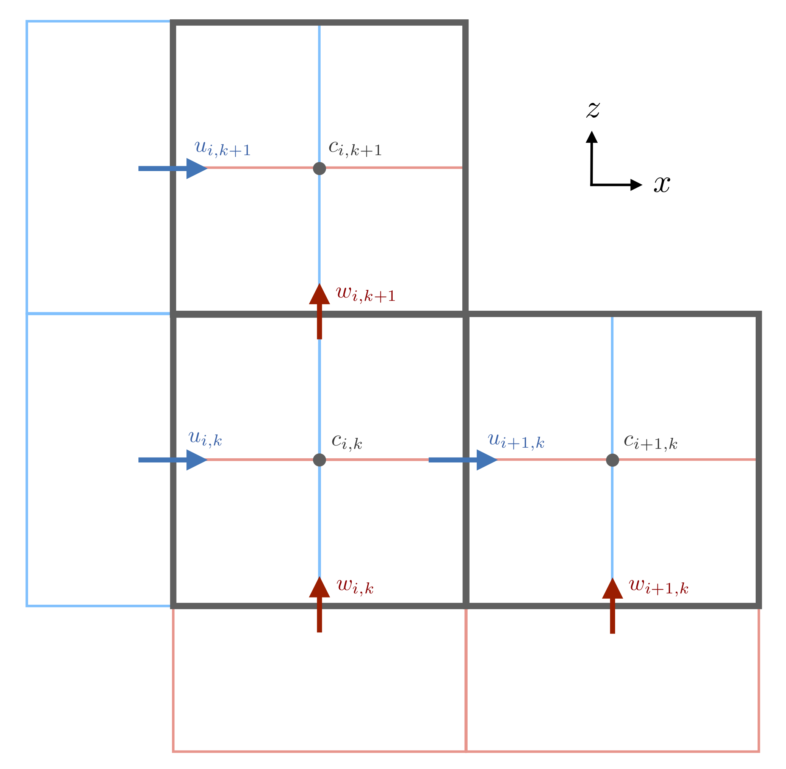

# Finite volume method on a staggered grid

The `Oceananigans.jl` staggered grid is defined by a rectilinear array of cuboids of horizontal dimensions 
``\Delta x_{i, j, k}, \Delta y_{i, j, k}`` and vertical dimension 
``\Delta z_{i, j, k}``, where ``(i, j, k)`` index the location of each cell in the staggered grid.
Note that the indices ``(i, j, k)`` increase with increasing coordinate ``(x, y, z)``.


*A schematic of `Oceananigans.jl` finite volumes for a two-dimensional staggered grid in ``(x, z)``.
Tracers ``c`` and pressure ``p`` are defined at the center of the control volume. The ``u`` control volumes are 
centered on the left and right edges of the pressure control volume while the ``w`` control volumes are centered 
on the top and bottom edges of the pressure control volumes. The indexing convention places the ``i^{\rm{th}}`` 
``u``-node on cell ``x``-faces to the left of the ``i`` tracer point at cell centers.*

Dropping explicit indexing, the areas of cell faces are given by
```math
    A_x = \Delta y \Delta z, \quad A_y = \Delta x \Delta z, \quad A_z = \Delta x \Delta y \, ,
```
so that each cell encloses a volume ``V = \Delta x \Delta y \Delta z``.

A finite volume method discretizes a continuous quantity ``c`` by considering its average over a finite volume:
```math
    c_{i, j, k} \equiv \frac{1}{V_{i, j, k}} \int c(\boldsymbol{x}) \, \mathrm{d} V_{i, j, k} \, .
```
The finite volumes that discretize each of ``u``, ``v``, and ``w`` are located on a grid which is "staggered" 
with respect to the grid that defines tracer finite volumes. 
The nodes, or central points of the velocity finite volumes are co-located with the faces of the tracer 
finite volume.
In particular, the ``u``-nodes are located in the center of the "``x``-face" (east of the tracer point), 
``v``-nodes are located on ``y``-faces south of the tracer point, and ``w``-nodes are located on 
``z``-faces downwards from the tracer point.
