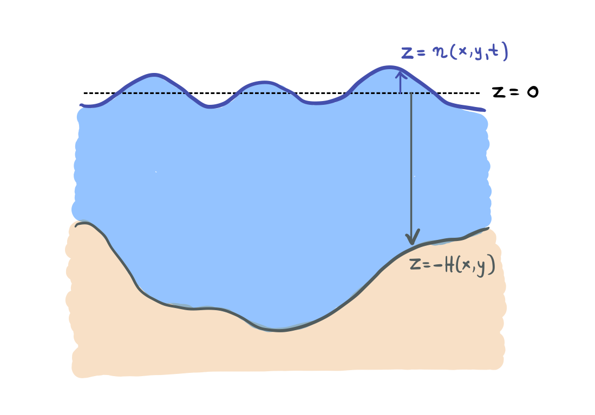

# Generalized vertical coordinate

For [`HydrostaticFreeSurfaceModel()`](@ref), we have the choice between a `ZCoordinate` and a `ZStar` vertical coordinate.
A `ZStar` vertical coordinate conserves tracers and volume with the grid following the evolution of the free surface in the
domain [adcroft2004rescaled](@citep).

We denote any generalized vertical coordinate that evolves with space and time as ``r(x, y, z, t)``.
The generalized vertical coordinate must vary monotonically with ``z``.

Transforming the equations of motions (including their discrete analogues) in this new generalized coordinate
involves a series of chain rules for partial differentiation. We have that

```math
\begin{align}
    \frac{\partial \phi}{\partial z} & = \frac{\partial r}{\partial z} \frac{\partial \phi}{\partial r} \\
    \frac{\partial \phi}{\partial r} & = \frac{\partial z}{\partial r} \frac{\partial \phi}{\partial z}
\end{align}
```

We'll see that ``\partial z/\partial r`` will be appearing a lot. This is often referred to as "specific thickness"
and is denoted ``\sigma``
```math
\sigma \equiv \frac{\partial z}{\partial r} \bigg\rvert_{x, y, t} = \left(\frac{\partial r}{\partial z} \bigg\rvert_{x, y, t}\right)^{-1}
```

Above, the subscripts next to ``\vert`` denote the quantities that remain constant in the differentiation.

With that, we have that:

```math
\begin{align}
    \frac{\partial \phi}{\partial s} \bigg\rvert_{z} & = \frac{\partial \phi}{\partial s}\bigg\rvert_{r} + \frac{\partial \phi}{\partial r} \frac{\partial r}{\partial s} \label{dphids} \\
    \frac{\partial \phi}{\partial z} & = \frac{1}{\sigma}\frac{\partial \phi}{\partial r} \label{dphidz}
\end{align}
```
where ``s = x, y, t``.

The horizontal spatial derivatives of the ``r``-coordinate are then rewritten, e.g.,
```math
\begin{equation}
    \frac{\partial r}{\partial x} \bigg\rvert_{y, z, t} = - \frac{\partial z}{\partial x} \bigg\rvert_{y, r, t} \frac{1}{\sigma} \label{drdx}
\end{equation}
```
so that the chain rule above becomes
```math
\begin{align}
    \frac{\partial \phi}{\partial x} \bigg\rvert_{z} & = \frac{\partial \phi}{\partial x}\bigg\rvert_{r} - \frac{1}{\sigma}\frac{\partial \phi}{\partial r} \frac{\partial z}{\partial x} \label{dphidx}
\end{align}
```
Similarly, we get equivalent expressions for ``y`` derivatives as in \eqref{drdx} and \eqref{dphidx}.

For a `ZCoordinate`,
```math
r(x, y, z, t) = z
```
and the specific thickness is ``\sigma = 1``.



For `ZStar`,
```math
\begin{equation}
    r(x, y, z, t) = \frac{z - \eta(x, y, t)}{H(x, y) + \eta(x, y, t)} H(x, y) \label{zstardef}
\end{equation}
```
where ``\eta`` is the free surface and ``z = -H(x, y)`` is the bottom of the domain,
giving a specific thickness ``\sigma = 1 + \eta / H``.

## Mass conservation

The [mass conservation](@ref hydrostatic_mass_conservation_free_surface) is equivalent to the flow being divergence-less, i.e., ``\boldsymbol{\nabla} \boldsymbol{\cdot} \boldsymbol{v} = \boldsymbol{\nabla}_h \boldsymbol{\cdot} \boldsymbol{u} + \partial_z w = 0``.

Following the above ruleset, divergence of the flow can be rewritten as
```math
\begin{align}
    \boldsymbol{\nabla} \boldsymbol{\cdot} \boldsymbol{v} & = \frac{\partial u}{\partial x} \bigg\rvert_{z} + \frac{\partial v}{\partial y} \bigg\rvert_{z} + \frac{\partial w}{\partial z} \nonumber \\
    & = \frac{\partial u}{\partial x} \bigg\rvert_{r} + \frac{\partial v}{\partial y} \bigg\rvert_{r} - \frac{1}{\sigma} \left( \frac{\partial u}{\partial r} \frac{\partial z}{\partial x} + \frac{\partial v}{\partial r} \frac{\partial z}{\partial y} - \frac{\partial w}{\partial r} \right) \nonumber \\
    & = \frac{1}{\sigma} \left( \frac{\partial \sigma u}{\partial x} \bigg\rvert_{r} + \frac{\partial \sigma v}{\partial y} \bigg\rvert_{r} - u \frac{\partial \sigma}{\partial x} \bigg\rvert_{r} - v \frac{\partial \sigma}{\partial y} \bigg\rvert_{r} \right)- \frac{1}{\sigma} \left( \frac{\partial u}{\partial r} \frac{\partial z}{\partial x} + \frac{\partial v}{\partial y} \frac{\partial z}{\partial y} - \frac{\partial w}{\partial r} \right)
\end{align}
```
We can rewrite ``\partial_x \sigma \rvert_r = \partial_r(\partial_x z)`` and similarly for the ``y`` direction. After a bit of reordering the above yields
```math
\begin{equation}
    \boldsymbol{\nabla} \boldsymbol{\cdot} \boldsymbol{v} = \frac{1}{\sigma} \left( \frac{\partial \sigma u}{\partial x} \bigg\rvert_{r} + \frac{\partial \sigma v}{\partial y}\bigg\rvert_{r} \right) + \frac{1}{\sigma} \frac{\partial}{\partial r} \left( u \frac{\partial z}{\partial x} + v \frac{\partial z}{\partial y} + w \right) \label{div1}
\end{equation}
```
Note that ``w`` above is the vertical velocity referenced to the ``z`` coordinate.
The vertical velocity ``w_r`` of the ``r`` surface referenced to the ``z`` coordinate as
```math
w_r \equiv \frac{\partial z}{\partial t} \bigg\rvert_r + u \frac{\partial z}{\partial x} + v \frac{\partial z}{\partial y}
```
Then, the vertical velocity across the ``r`` surfaces is the difference between ``w`` and ``w_r``
```math
\begin{align}
    \omega & \equiv w - w_r \nonumber \\
           & = w - \frac{\partial z}{\partial t} \bigg\rvert_r - u \frac{\partial z}{\partial x} - v \frac{\partial z}{\partial y} \label{def_omega}
\end{align}
```
With the definition of ``\omega`` in \eqref{div1} we get
```math
\begin{align}
    \boldsymbol{\nabla} \boldsymbol{\cdot} \boldsymbol{v} & = \frac{1}{\sigma} \left( \frac{\partial \sigma u}{\partial x} \bigg\rvert_{r} + \frac{\partial \sigma v}{\partial y}\bigg\rvert_{r} \right) + \frac{1}{\sigma} \frac{\partial}{\partial r} \left( \omega + \frac{\partial z}{\partial t}\bigg\rvert_r \right) \nonumber \\
    & = \frac{1}{\sigma} \left( \frac{\partial \sigma u}{\partial x} \bigg\rvert_{r} + \frac{\partial \sigma v}{\partial y}\bigg\rvert_{r} \right) + \frac{1}{\sigma} \frac{\partial \omega}{\partial r} + \frac{1}{\sigma} \frac{\partial \sigma}{\partial t}
\end{align}
```
which implies that the mass conservation is equivalent to:
```math
\begin{equation}
    \frac{\partial \sigma}{\partial t} + \frac{\partial \sigma u}{\partial x} \bigg\rvert_{r} + \frac{\partial \sigma v}{\partial y}\bigg\rvert_{r} + \frac{\partial \omega}{\partial r} = 0 \label{massconservationr}
\end{equation}
```

## Tracer equation
The tracer equation, when we also include vertical diffusion, reads
```math
\begin{equation}
    \frac{\partial T}{\partial t}\bigg\rvert_{z} + \boldsymbol{\nabla} \boldsymbol{\cdot} (\boldsymbol{u} T) = \frac{\partial}{\partial z} \left( \kappa \frac{\partial T}{\partial z} \right) \label{tracereq}
\end{equation}
```
Using the same procedure we followed for the continuity equation, the left-hand-side of \eqref{tracereq} yields:
```math
\begin{align}
    \frac{\partial T}{\partial t}\bigg\rvert_{z} & + \boldsymbol{\nabla} \boldsymbol{\cdot} (\boldsymbol{u} T) = \nonumber \\
    & = \frac{\partial T}{\partial t}\bigg\rvert_{z} + \frac{1}{\sigma} \left( \frac{\partial \sigma u T}{\partial x} \bigg\rvert_{r} + \frac{\partial \sigma v T}{\partial y}\bigg\rvert_{r} \right) + \frac{1}{\sigma} \frac{\partial}{\partial r}\left( T\omega + T \frac{\partial z}{\partial t}\bigg\rvert_r \right) \nonumber \\
    & = \frac{\partial T}{\partial t}\bigg\rvert_{z} + \frac{1}{\sigma} \left( \frac{\partial \sigma u T}{\partial x} \bigg\rvert_{r} + \frac{\partial \sigma v T}{\partial y}\bigg\rvert_{r} \right) + \frac{1}{\sigma} T\left( \frac{\partial \omega}{\partial r} + \frac{\partial \sigma}{\partial t}\bigg\rvert_{r} \right) + \frac{1}{\sigma} \left( \omega + \frac{\partial z}{\partial t}\bigg\rvert_r \right)\frac{\partial T}{\partial r} \nonumber\\
    & = \frac{\partial T}{\partial t}\bigg\rvert_{z} + \frac{1}{\sigma} \left( \frac{\partial \sigma u T}{\partial x} \bigg\rvert_{r} + \frac{\partial \sigma v T}{\partial y}\bigg\rvert_{r} \right) + \frac{1}{\sigma} \frac{\partial \omega T}{\partial r} + \frac{1}{\sigma}T \frac{\partial \sigma}{\partial t}\bigg\rvert_{r} + \frac{1}{\sigma}  \frac{\partial z}{\partial t}\bigg\rvert_r \frac{\partial T}{\partial r}
\end{align}
```
We recover the time derivative of the tracer at constant ``r`` by rewriting the last term using the chain rule for a time derivatives:
```math
\frac{1}{\sigma}  \frac{\partial z}{\partial t}\bigg\rvert_r \frac{\partial T}{\partial r} = \frac{\partial r}{\partial t} \frac{\partial T}{\partial r} = \frac{\partial T}{\partial t}\bigg\rvert_{r} - \frac{\partial T}{\partial t}\bigg\rvert_{z}
```
As such, the left-hand-side of \eqref{tracereq} can be rewritten in ``r``-coordinates as
```math
    \frac{1}{\sigma}\frac{\partial \sigma T}{\partial t}\bigg\rvert_r + \frac{1}{\sigma} \left( \frac{\partial \sigma u T}{\partial x} \bigg\rvert_{r} + \frac{\partial \sigma v T}{\partial y}\bigg\rvert_{r} \right) + \frac{1}{\sigma} \frac{\partial \omega T}{\partial r}
```
Including the vertical diffusion to the right-hand side we recover the tracer equation:
```math
\begin{equation}
    \frac{1}{\sigma}\frac{\partial \sigma T}{\partial t} \bigg\rvert_r + \frac{1}{\sigma} \left( \frac{\partial \sigma u T}{\partial x} \bigg\rvert_{r} + \frac{\partial \sigma v T}{\partial y}\bigg\rvert_{r} \right) + \frac{1}{\sigma} \frac{\partial T \omega}{\partial r} = \frac{1}{\sigma}\frac{\partial}{\partial r} \left( \kappa \frac{\partial T}{\partial z} \right) \label{tracerrcoord}
\end{equation}
```

## Momentum equations in vector invariant form

The horizontal momentum equation reads
```math
\begin{equation}
    \frac{\mathrm{D} \boldsymbol{u}}{\mathrm{D}t} \bigg\rvert_z + f \hat{\boldsymbol{z}} \times \boldsymbol{u} = - \boldsymbol{\nabla} p \rvert_z - g \boldsymbol{\nabla} \eta \rvert_z + \frac{\partial}{\partial z}  \left(\nu \frac{\partial \boldsymbol{u}_h}{\partial z}\right) \label{momentumh}
\end{equation}
```
where we remind that ``\boldsymbol{u} = u \hat{\boldsymbol{x}} + v \hat{\boldsymbol{y}}`` is the horizontal velocity, ``\boldsymbol{v} = \boldsymbol{u} + w \hat{\boldsymbol{z}}`` is the three-dimensional velocity, and ``\mathrm{D} / \mathrm{D}t \equiv \partial_t + \boldsymbol{v \cdot \nabla}`` is the material derivative.

The above is complemented by the hydrostatic relation
```math
\begin{equation}
    \frac{\partial p}{\partial z} = b \label{hydrostatic}
\end{equation}
```

Of the above, the Coriolis term is independent of the vertical frame of reference and the viscous stress is treated similarly to the diffusion of a tracer. In this derivation we focus on:
1. the hydrostatic relation \eqref{hydrostatic},
2. the material derivative in the momentum equation \eqref{momentumh}, and
3. the horizontal pressure gradient terms in \eqref{momentumh}.

### Hydrostatic relation
Using the definition \eqref{dphidz} of the `z`-derivative in `r`-coordinates
```math
\begin{equation}
    \frac{\partial p}{\partial r} = \sigma b \label{hydrostaticrcoord}
\end{equation}
```

### Material derivative in vector invariant form

We set out to transform in ``r``-coordinates the material derivative of the horizontal velocity in vector invariant form
```math
\frac{\mathrm{D} \boldsymbol{u}}{\mathrm{D} t} \bigg\rvert_z = \frac{\partial \boldsymbol{u}}{\partial t} \bigg\rvert_z + \zeta \hat{\boldsymbol{z}} \times \boldsymbol{u} + \boldsymbol{\nabla}_h K + w \frac{\partial \boldsymbol{u}}{\partial z}
```
where ``\zeta = \partial_x v - \partial_y u`` is the vertical vorticity, and ``K \equiv (u^2 + v^2)/2`` is the horizontal kinetic energy.

Here, we focus on the ``u`` component of the velocity; the derivation of the ``v`` component follows the same steps.
Thus, we are transforming
```math
\begin{align*}
    \frac{\mathrm{D}u}{\mathrm{D}t} \bigg\rvert_z & = \frac{\partial u}{\partial t} \bigg\rvert_z - \zeta \rvert_z v + \frac{\partial K}{\partial x}\bigg\rvert_z + w \frac{\partial u}{\partial z} \\

    & = \frac{\partial u}{\partial t} \bigg\rvert_z - \left(\frac{\partial v}{\partial x}\bigg\rvert_z - \frac{\partial u}{\partial y}\bigg\rvert_z \right) v + \frac{\partial K}{\partial x}\bigg\rvert_z + w \frac{\partial u}{\partial z} \\

    & = \frac{\partial u}{\partial t} \bigg\rvert_z - \bigg(\underbrace{\frac{\partial v}{\partial x}\bigg\rvert_r - \frac{\partial u}{\partial y}\bigg\rvert_r}_{\zeta|_r} - \frac{1}{\sigma} \frac{\partial v}{\partial r} \frac{\partial z}{\partial x} + \frac{1}{\sigma} \frac{\partial u}{\partial r} \frac{\partial z}{\partial y} \bigg) v + \frac{\partial K}{\partial x}\bigg\rvert_r - \frac{1}{\sigma} \frac{\partial K}{\partial r}\frac{\partial z}{\partial x} + w \frac{\partial u}{\partial z} \\

    % & = \frac{\partial u}{\partial t} \bigg\rvert_z - \zeta\rvert_r v - \frac{1}{\sigma} \left(\frac{\partial u}{\partial r} \frac{\partial z}{\partial y} - \frac{\partial v}{\partial r} \frac{\partial z}{\partial x} \right) v + \frac{\partial K}{\partial x}\bigg\rvert_z + w \frac{\partial u}{\partial z} \\

    % & = \frac{\partial u}{\partial t} \bigg\rvert_z - \zeta\rvert_r v - \frac{1}{\sigma} \left(\frac{\partial u}{\partial r} \frac{\partial z}{\partial y} - \frac{\partial v}{\partial r} \frac{\partial z}{\partial x}   \right)  v + \frac{\partial K}{\partial x}\bigg\rvert_r - \frac{1}{\sigma} \frac{\partial K}{\partial r}\frac{\partial z}{\partial x} + w \frac{\partial u}{\partial z}
\end{align*}
```
Above, we utilized \eqref{dphids} and \eqref{drdx} repeatedly, e.g., for ``\partial_y u \rvert_z``, ``\partial_x v \rvert_z``, and ``\partial_x K \rvert_z``.
Further expanding ``\partial_r K = u \partial_r u + v \partial_r v``, a few terms cancel out and we end up with:
```math
\begin{align}
    \frac{\mathrm{D}u}{\mathrm{D}t} \bigg\rvert_z
    % & = \frac{\partial u}{\partial t} \bigg\rvert_z - \zeta\rvert_r v + \frac{\partial K}{\partial x}\bigg\rvert_r + \frac{1}{\sigma} \left( w \frac{\partial u}{\partial r} - v\frac{\partial u}{\partial r} \frac{\partial z}{\partial y} + v\frac{\partial v}{\partial r} \frac{\partial z}{\partial x} - u \frac{\partial u}{\partial r}\frac{\partial z}{\partial x}- v \frac{\partial v}{\partial r}\frac{\partial z}{\partial x}\right) \\
    % & = \frac{\partial u}{\partial t} \bigg\rvert_z - \zeta\rvert_r v + \frac{\partial K}{\partial x}\bigg\rvert_r + \frac{1}{\sigma} \left( w \frac{\partial u}{\partial r} - v \frac{\partial u}{\partial r} \frac{\partial z}{\partial y} - u \frac{\partial u}{\partial r}\frac{\partial z}{\partial x}\right) \nonumber \\
    & = \frac{\partial u}{\partial t} \bigg\rvert_z - \zeta\rvert_r v + \frac{\partial K}{\partial x}\bigg\rvert_r + \frac{1}{\sigma} \left( w - v \frac{\partial z}{\partial y} - u \frac{\partial z}{\partial x}\right)  \frac{\partial u}{\partial r} \label{expr1}
\end{align}
```
Using the definition of ``\omega`` in \eqref{def_omega}, we can rewrite \eqref{expr1} as
```math
\begin{align}
    \frac{\mathrm{D}u}{\mathrm{D}t} \bigg\rvert_z & = \frac{\partial u}{\partial t} \bigg\rvert_z - \zeta\rvert_r v + \frac{\partial K}{\partial x}\bigg\rvert_r + \frac{1}{\sigma} \left( \omega + \frac{\partial z}{\partial t}\bigg\rvert_r \right)  \frac{\partial u}{\partial r}
\end{align}
```
As done above for the tracer, the last term on the right-hand side, using the chain rule for the time derivative yields
```math
\frac{1}{\sigma} \left( \omega + \frac{\partial z}{\partial t}\bigg\rvert_r \right)  \frac{\partial u}{\partial r} = \frac{\omega}{\sigma}\frac{\partial u}{\partial r} + \frac{\partial u}{\partial t}\bigg\rvert_r - \frac{\partial u}{\partial t}\bigg\rvert_z
```
Which completes the derivation of the ``u``-momentum equations in ``r``-coordinates
```math
\frac{\mathrm{D}u}{\mathrm{D}t} \bigg\rvert_z = \frac{\partial u}{\partial t} \bigg\rvert_r - \zeta\rvert_r v + \frac{\partial K}{\partial x}\bigg\rvert_r + \frac{\omega}{\sigma}\frac{\partial u}{\partial r}
```
We can further split the vertical advection term into a conservative vertical advection and a horizontal divergence term:
```math
\frac{\mathrm{D}u}{\mathrm{D}t} \bigg\rvert_z = \frac{\partial u}{\partial t} \bigg\rvert_r - \zeta\rvert_r v + \frac{\partial K}{\partial x}\bigg\rvert_r + \frac{1}{\sigma}\frac{\partial \omega u}{\partial r} - \frac{u}{\sigma} \frac{\partial \omega}{\partial r}
```
and last use the continuity equation \eqref{massconservationr} to obtain
```math
\begin{equation}
    \frac{\mathrm{D}u}{\mathrm{D}t} \bigg\rvert_z = \frac{\partial u}{\partial t} \bigg\rvert_r - \zeta\rvert_r v + \frac{\partial K}{\partial x}\bigg\rvert_r + \frac{1}{\sigma}\frac{\partial \omega u}{\partial r} + \frac{u}{\sigma} \left( \frac{\partial \sigma}{\partial t} + \frac{\partial \sigma u}{\partial x} \bigg\rvert_{r} + \frac{\partial \sigma v}{\partial y}\bigg\rvert_{r}\right)
\end{equation}
```

### Horizontal pressure gradient

The horizontal pressure gradients, e.g., ``\partial_x p``, can be transformed using the chain rule \eqref{dphidx}:
```math
\begin{equation}
    \frac{\partial p}{\partial x} \bigg\rvert_z = \frac{\partial p}{\partial x}\bigg\rvert_r - \frac{1}{\sigma}\frac{\partial p}{\partial r}\frac{\partial z}{\partial x}
\end{equation}
```
and combined with the hydrostatic relation \eqref{hydrostaticrcoord}:
```math
\begin{equation}
    \frac{\partial p}{\partial x}\bigg\rvert_z = \frac{\partial p}{\partial x}\bigg\rvert_r - b \frac{\partial z}{\partial x}
\end{equation}
```
The last term on the right hand side above describes the pressure gradient associated with the horizontal tilting of the grid.
Similarly, the gradient of the free surface transforms to
```math
\begin{align}
    \frac{\partial \eta}{\partial x} \bigg\rvert_z & = \frac{\partial \eta}{\partial x}\bigg\rvert_r - \frac{1}{\sigma} \frac{\partial \eta}{\partial r}\frac{\partial z}{\partial x}
\end{align}
```

For the `ZStar` coordinate \eqref{zstardef}, the term ``\partial \eta/\partial r`` identically vanishes and thus the gradient of the
free surface remains unchanged under vertical coordinate transformation
```math
\begin{align}
    \frac{\partial \eta}{\partial x} \bigg\rvert_z & = \frac{\partial \eta}{\partial x} \bigg\rvert_r
\end{align}
```

## Finite volume discretization

It is usefull to describe how the above equations translate into discrete form in a finite volume staggered C-grid framework.

To do so, we integrate over the cell volume ``V_r = \Delta x \Delta y \Delta r`` remembering that in the discrete ``\Delta z = \sigma \Delta r``.
Indices `i`, `j`, `k` below correspond to the `x`, `y`, and the vertical directions respectively.

### Mass conservation

The mass conservation \eqref{massconservationr} gives:
```math
\begin{equation}
    \frac{1}{V_r}\int_{V_r} \frac{\partial \sigma}{\partial t} \, \mathrm{d}V + \frac{1}{V_r} \int_{V_r} \left(\frac{\partial \sigma u}{\partial x} \bigg\rvert_{r} + \frac{\partial \sigma v}{\partial y}\bigg\rvert_{r} + \frac{\partial \omega}{\partial r}\right) \, \mathrm{d}V = 0 \label{massdiscr1}
\end{equation}
```
Using the notation for cell-averages ``\overline{\phi} \equiv V_r^{-1} \int_{V_r} \phi \,\mathrm{d}V`` and also the divergence theorem,
we can rewrite \eqref{massdiscr1} to:
```math
\begin{equation}
    \frac{\partial \overline{\sigma}}{\partial t} + \frac{1}{\Delta x \Delta y \Delta r} \left( \Delta y \Delta r \, \sigma u \rvert_{i-1/2}^{i+1/2} + \Delta x \Delta r \, \sigma v \rvert_{j-1/2}^{j+1/2} \right ) + \frac{\overline{\omega}_{k+1/2} - \overline{\omega}_{k-1/2}}{\Delta r} = 0 \label{massdiscr2}
\end{equation}
```
We use \eqref{massdiscr2} diagnose the vertical velocity (in ``r`` space) given the grid velocity and the horizontal velocity divergence:
```math
\overline{\omega}_{k+1/2} = \overline{\omega}_{k-1/2} + \Delta r \frac{\partial \overline{\sigma}}{\partial t} + \frac{1}{Az} \left( \mathcal{U}\rvert_{i-1/2}^{i+1/2} + \mathcal{V}\rvert_{j-1/2}^{j+1/2} \right )
```
where ``\mathcal{U} = Ax \, u``, ``\mathcal{V} = Ay \, v``, ``Ax = \Delta y \, \Delta z``, ``Ay = \Delta x \, \Delta z``, and ``Az = \Delta x \, \Delta y``.

### Tracer equation

The tracer equation \eqref{tracerrcoord} in discrete form becomes:
```math
\frac{1}{V_r}\int_{V_r} \frac{1}{\sigma}\frac{\partial \sigma T}{\partial t} \, \mathrm{d}V + \frac{1}{V_r} \int_{V_r} \left[ \frac{1}{\sigma} \left( \frac{\partial \sigma u T}{\partial x} \bigg\rvert_{r} + \frac{\partial \sigma v T}{\partial y}\bigg\rvert_{r} \right) + \frac{1}{\sigma} \frac{\partial \omega T}{\partial r}\right] \, \mathrm{d}V = \frac{1}{V_r}\int_{V_r} \frac{1}{\sigma}\frac{\partial}{\partial r} \left( \kappa \frac{\partial T}{\partial z} \right) \, \mathrm{d}V
```
leading to
```math
\frac{1}{\sigma}\frac{\partial \sigma \overline{T}}{\partial t} + \frac{\mathcal{U}T\rvert_{i-1/2}^{i+1/2} + \mathcal{V}T\rvert_{j-1/2}^{j+1/2} + \mathcal{W} T\rvert_{k-1/2}^{k+1/2}}{V} = \frac{1}{V} \left(\mathcal{K} \frac{\partial T}{\partial z}\bigg\rvert_{k-1/2}^{k+1/2} \right)
```
where ``V = \sigma V_r = \Delta x \, \Delta y \, \Delta z``, ``\mathcal{W} = Az \, \omega``, and ``\mathcal{K} = Az \, \kappa``.

For an explicit formulation of the diffusive fluxes and a time-discretization using forward Euler scheme, imply:
```math
\begin{equation}
    T^{n+1} = \frac{\sigma^n}{\sigma^{n+1}}\left(T^n + \Delta t \, G^n \right)
\end{equation}
```
where ``G^n`` is tendency computed on the `z`-grid.

Note that in case of a multi-step method, e.g., second-order Adams Bashforth, the grid at different time-steps must be accounted for, and the time-discretization becomes
```math
\begin{equation}
    T^{n+1} = \frac{1}{\sigma^{n+1}}\left[\sigma^n T^n + \Delta t \left(\frac{3}{2}\sigma^n G^n - \frac{1}{2} \sigma^{n-1} G^{n-1} \right)\right]
\end{equation}
```
For this reason, we store tendencies pre-multipled by ``\sigma`` at their current time-level.
In case of an implicit discretization of the diffusive fluxes we first compute ``T^{n+1}`` as in the above equation (where ``G^n`` does not contain the diffusive fluxes).
Then the implicit step is done on a `z`-grid as if the grid was static, using the grid at ``n+1`` which includes ``\sigma^{n+1}``.
