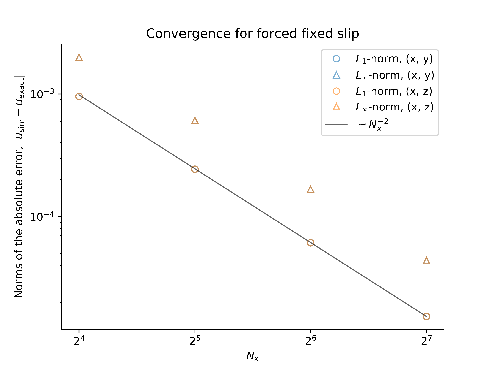

# Convergence Tests

Convergence tests are implemented in `/validation/convergence_tests` and range
from zero-dimensional time-stepper tests to two-dimensional integration tests that
involve non-trivial pressure fields, advection, and diffusion.

For all tests except point exponential decay, we use the ``L_1`` norm,

```math
    L_1 \equiv \frac{\mathrm{mean} | \phi_\mathrm{sim} - \phi_\mathrm{exact} |}{\mathrm{mean} | \phi_\mathrm{exact} |}
```

and ``L_\infty`` norm,

```math
    L_\infty \equiv \frac{\max | \phi_\mathrm{sim} - \phi_\mathrm{exact} |}{\max | \phi_\mathrm{exact} |} \, ,
```

to compare simulated fields, ``\phi_\mathrm{sim}``, with exact, analytically-derived solutions
``\phi_\mathrm{exact}``.
The field ``\phi`` may be a tracer field or a velocity field.

## Point Exponential Decay

This test analyzes time-stepper convergence by simulating the zero-dimensional, or spatially-uniform equation

```math
    \partial_t c = - c \, ,
```

with the initial condition ``c = 1``, which has the analytical solution ``c = \mathrm{e}^{-t}``.

We find the expected first-order convergence with decreasing time-step ``\Delta t`` using our
first-order accurate, "modified second-order" Adams-Bashforth time-stepping method:


This result validates the correctness of the `Oceananigans` implementation of Adams-Bashforth time-stepping.

## One-dimensional advection and diffusion of a Gaussian

This and the following tests focus on convergence with grid spacing, ``\Delta x``.

In one dimension with constant diffusivity ``\kappa`` and in the presence of a
constant velocity ``U``, a Gaussian evolves according to

```math
    c = \frac{\mathrm{e}^{- (x - U t)^2 / 4 \kappa t}}{\sqrt{4 \pi \kappa t}} \, .
```

For this test we take the initial time as ``t=t_0``.
We simulate this problem with advection and diffusion, as well as with ``U=0`` and thus diffusion only, as well as with
``\kappa \approx 0`` and thus "advection only".
The solutions are


which exhibit the expected second-order convergence with ``\Delta x^2 \propto 1 / N_x^2``:


These results validate the correctness of time-stepping, constant diffusivity operators, and advection operators.

## One-dimensional advection and diffusion of a cosine

In one dimension with constant diffusivity ``\kappa`` and in the presence of a
constant velocity ``U``, a cosine evolves according to

```math
    c = \mathrm{e}^{-\kappa t} \cos (x - U t) \, .
```

The solutions are


which exhibit the expected second-order convergence with ``\Delta x^2 \propto 1 / N_x^2``:


These results validate the correctness of time-stepping, constant diffusivity operators, and advection operators.

## Two-dimensional diffusion

With zero velocity field and constant diffusivity ``\kappa``, the tracer field

```math
    c(x, y, t=0) = \cos(x) \cos(y) \, ,
```

decays according to

```math
    c(x, y, t) = \mathrm{e}^{-2 \kappa t} \cos(x) \cos(y) \, ,
```

with either periodic boundary conditions, or insulating boundary conditions in either ``x`` or ``y``.

The expected convergence with ``\Delta x^2 \propto 1 / N_x^2`` is observed:


This validates the correctness of multi-dimensional diffusion operators.

## Decaying, advected Taylor-Green vortex

The velocity field

```math
\begin{align}
    u(x, y, t) & = U + \mathrm{e}^{-t} \cos(x - U t) \sin(y) \, , \\
    v(x, y, t) & =   - \mathrm{e}^{-t} \sin(x - U t) \cos(y) \, ,
\end{align}
```

is a solution to the Navier-Stokes equations with viscosity ``\nu = 1``.

The expected convergence with spatial resolution is observed:


This validates the correctness of the advection and diffusion of a velocity field.

## Forced two-dimensional flows

We introduce two convergence tests associated with forced flows in domains that are 
bounded in ``y``, and periodic in ``x`` with no tracers.

*Note: in this section, subscripts are used to denote derivatives to make reading 
and typing equations easier.*

In a two-dimensional flow in ``(x, y)``, the velocity field ``(u, v)`` can be expressed in terms
of a streamfunction ``\psi(x, y, t)`` such that

```math
    u \equiv - \psi_y \, , \quad \text{and} \quad v \equiv \psi_x \, ,
```
where subscript denote derivatives such that ``\psi_y \equiv \partial_y \psi``, for example.
With an isotropic Laplacian viscosity ``\nu = 1``, the momentum and continuity equations are
```math
    \begin{align}
    \boldsymbol{u}_t + \left ( \boldsymbol{u} \boldsymbol{\cdot} \boldsymbol{\nabla} \right ) \boldsymbol{u} + \boldsymbol{\nabla} p & = \nabla^2 \boldsymbol{u} + \boldsymbol{F}_u \, , \\
    \boldsymbol{\nabla} \boldsymbol{\cdot} \boldsymbol{u} & = 0 \, ,
    \end{align}
```
while the equation for vorticity, ``\omega = v_x - u_y = \nabla^2 \psi``, is
```math
    \omega_t + \mathrm{J} \left ( \psi, \omega \right ) = \nabla^2 \omega + F_\omega \, .
```
Finally, taking the divergence of the momentum equation, we find a Poisson equation for pressure,
```math
    \nabla^2 p = - u_x^2 - v_y^2 - 2 u_y v_x + \partial_x F_u + \partial_y F_v \, .
```

To pose the problem, we first pick a streamfunction ``\psi``. This choice then yields the vorticity 
forcing ``F_{\omega}`` that satisfies the vorticity equation. We then determine ``F_u`` by solving 
``\partial_y F_u = - F_{\omega}``, and pick ``F_v`` so that we can solve the Poisson equation 
for pressure.

We restrict ourselves to a class of problems in which
```math
\psi(x, y, t) = - f(x, t) g(y) \, , \quad \text{with} \quad f \equiv \cos [x - \xi(t)] \, , \quad
\xi(t) \equiv 1 + \sin(t^2) \, .
```
Grinding through the algebra, this particular form implies that ``F_{\omega}`` is given by
```math
    F_{\omega} = -\xi^\prime f_x (g - g^{\prime\prime}) + f f_x (g g^{\prime\prime\prime} - g^\prime g^{\prime\prime}) + f (g - 2 g^{\prime\prime} + g^{\prime\prime\prime\prime}) \, ,
```
where primes denote derivatives of functions of a single argument. 
Setting ``\partial_y F_u = F_{\omega}``, we find that if ``F_v`` satisfies
```math
    \partial_y F_v = (g^\prime)^2 + g g^{\prime\prime} \, ,
```
then the pressure Poisson equation becomes
```math
    \nabla^2 p = \cos [2 (x - \xi)] [(g^\prime)^2 - g g^{\prime\prime}] + \partial_x F_u \, .
```
This completes the specification of the problem.

We set up the problem by imposing the time-dependent forcing functions ``F_u`` and ``F_v``
on ``u`` and ``v``, initializing the flow at ``t=0``, and integrating the problem forwards
in time using Oceananigans. We find the expected convergence of the numerical solution to the
analytical solution: the error between the numerical and analytical solutions
decreases with ``1/N_x^2 \sim \Delta x^2``, where ``N_x`` is the number of grid
points and ``\Delta x`` is the spatial resolution:


The convergence tests are performed using both ``y`` and ``z`` as the bounded direction.

### Forced, free-slip flow

A forced flow satisfying free-slip conditions at ``y = 0`` and ``y = \pi`` has the streamfunction
```math
    \psi(x, y, t) = - \cos [x - \xi(t)] \sin (y) \, ,
```
and thus ``g(y) = \sin y``. The velocity field ``(u, v)`` is
```math
    u = \cos (x - \xi) \cos y \, , \quad \text{and} \quad v = \sin (x - \xi) \sin y \, ,
```
which satisfies the boundary conditions ``u_y |_{y=0} = u_y |_{y=\pi} = 0`` and
``v |_{y=0} = v |_{y=\pi} = 0``. The vorticity forcing is
```math
    F_{\omega} = - 2 \xi^\prime f_x \sin y + 4 f \sin y \, ,
```
which implies that
```math
    F_u = - 2 \xi^\prime f_x \cos y + 4 f \cos y \, ,
```
and ``F_v = \tfrac{1}{2} \sin 2 y``.

## Forced, fixed-slip flow

A forced flow satisfying "fixed-slip" boundary conditions at ``y=0`` and ``y=1`` has
the streamfunction
```math
    \psi(x, y, t) = - \cos [x - \xi(t)] (y^3 - y^2) \, ,
```
and thus ``g(y) = y^3 - y^2``. The velocity field ``(u, v)`` is
```math
    u = f (3y^2 - 2 y) \, , \quad \text{and} \quad v = - f_x (y^3 - y^2) \, ,
```
which satisfies the boundary conditions
```math
    u |_{y=0} = 0 \, , \quad u |_{y=1} = f \, , \quad \text{and} \quad v |_{y=0} = v |_{y=1} = 0 \, .
```
The vorticity forcing is
```math
    F_{\omega} = - \xi^\prime f_x (y^3 - y^2 - 6y + 2) - f f_x (12 y^3 - 12 y^2 + 4 y) + f (y^3 - y^2 - 12 y + 4) \, ,
```
which implies that
```math
    F_u = \xi^\prime f_x (\tfrac{1}{4} y^4 - \tfrac{1}{3} y^3 - 3 y^2 + 2y)
        + f f_x (3 y^4 - 4 y^3 + 2y^2 ) 
        - f (\tfrac{1}{4} y^4 - \tfrac{1}{3} y^3 - 6 y^2 + 4 y) \, ,
```
and
```math
    F_v = 3 y^5 - 5 y^4 + 2y^3 \, .
```

We set up the problem in the same manner as the forced, free-slip problem above. Note that we 
also must the no-slip boundary condition ``u |_{y=0} = 0`` and the time-dependent fixed-slip 
condition ``u |_{y=1} = f``. As for the free-slip problem, we find that the error between the 
numerical and analytical solutions decreases with ``1 / N_x^2 \sim \Delta x^2``, where ``N_x``
is the number of grid points and ``\Delta x`` is the spatial resolution:



The convergence tests are performed using both ``y`` and ``z`` as the bounded direction.
