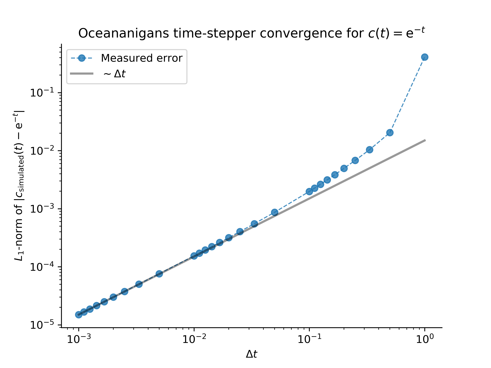
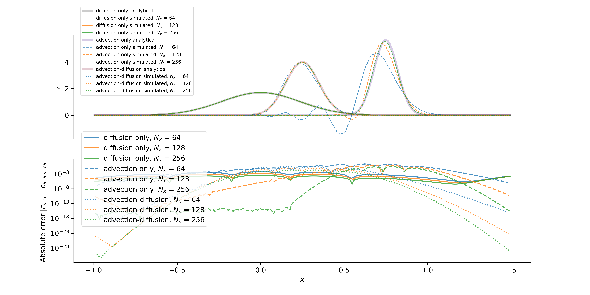
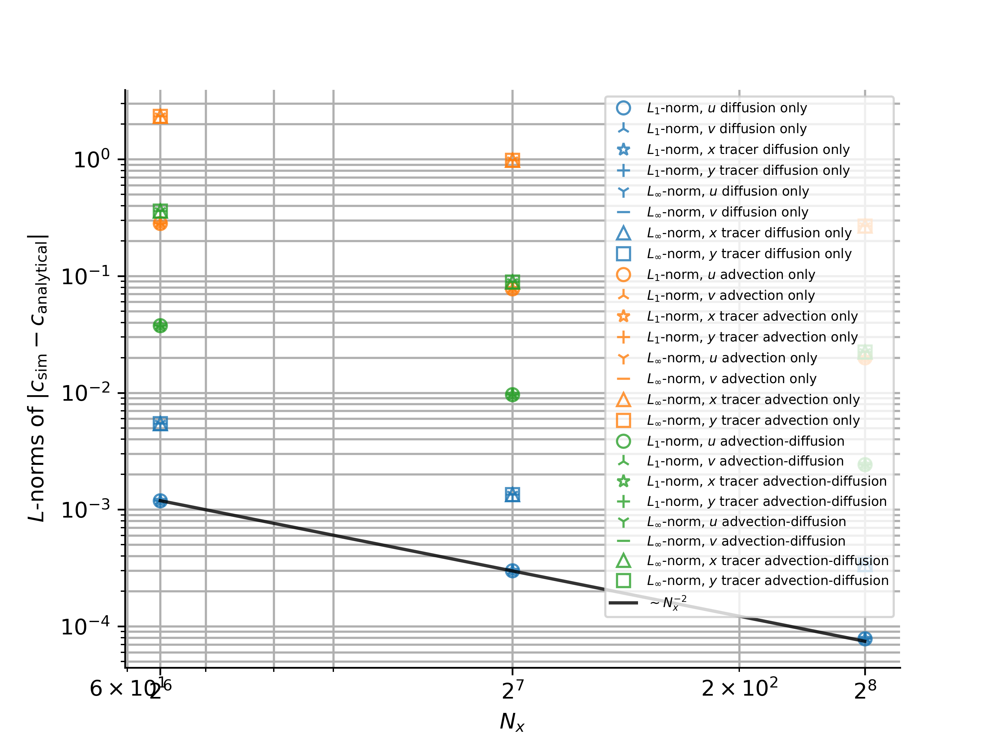
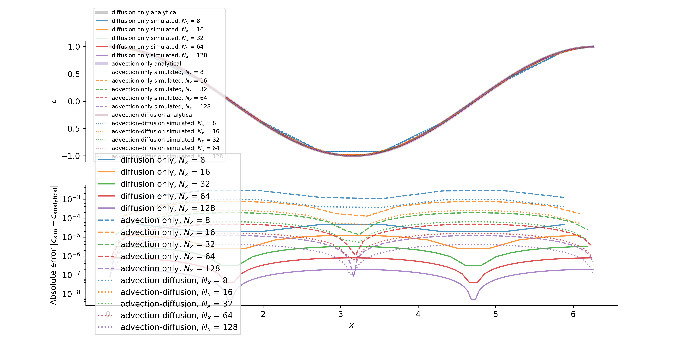
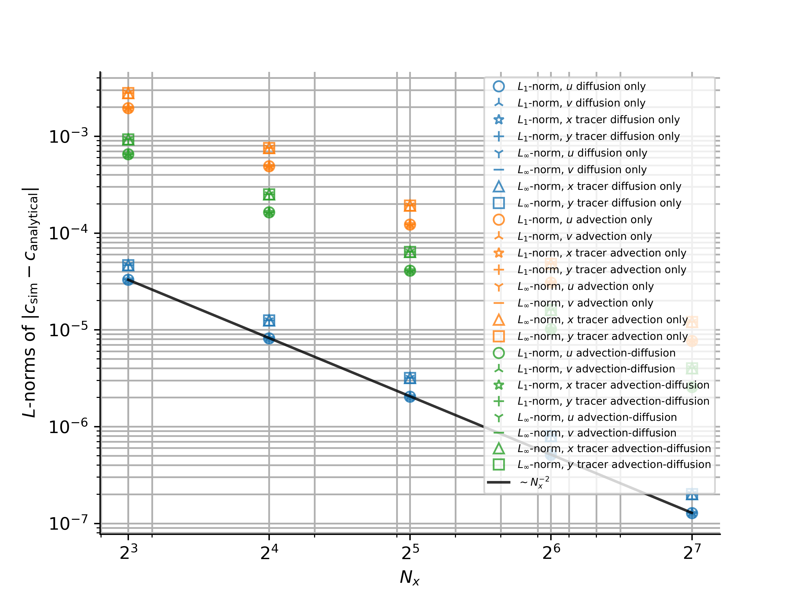
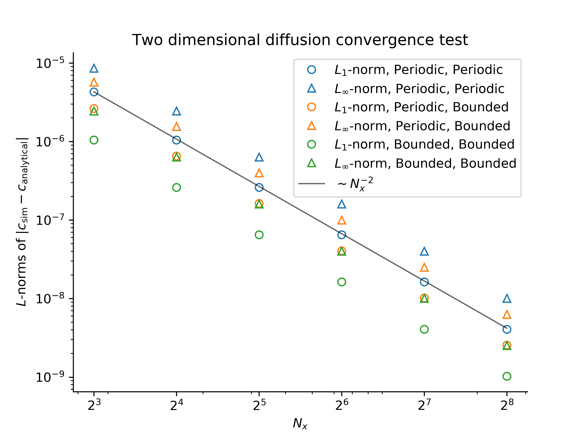
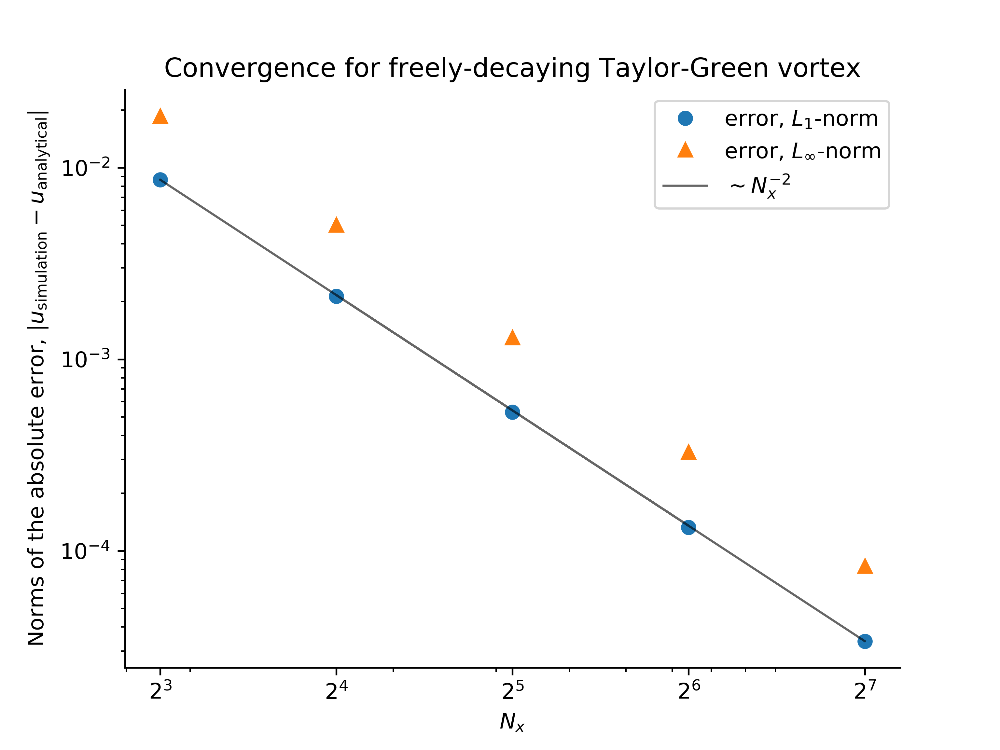

# Convergence Tests

Convergence tests are implemented in `/verification/convergence_tests` and range
from zero-dimensional time-stepper tests to two-dimensional integration tests that
involve non-trivial pressure fields, advection, and diffusion.

For all tests except point exponential decay, we use the ``L_1`` norm,

```math
L_1 \equiv \frac{\mathrm{mean} | \phi_\mathrm{sim} - \phi_\mathrm{exact} |}{\mathrm{mean} | \phi_\mathrm{exact} |}
```

and ``L_\infty`` norm,

```math
L_\infty \equiv \frac{\max | \phi_\mathrm{sim} - \phi_\mathrm{exact} |}{\max | \phi_\mathrm{exact} |}
```

to compare simulated fields, ``\phi_\mathrm{sim}``, with exact, analytically-derived solutions
``\phi_\mathrm{exact}``.
The field ``\phi`` may be a tracer field or a velocity field.

## Point Exponential Decay

This test analyzes time-stepper convergence by simulating the zero-dimensional, or spatially-uniform equation

```math
    \partial_t c = - c
```

with the initial condition ``c = 1``, which has the analytical solution ``c = \mathrm{e}^{-t}``.

We find the expected first-order convergence with decreasing time-step ``\Delta t`` using our
first-order accurate, "modified second-order" Adams-Bashforth time-stepping method:



This result validates the correctness of the `Oceananigans` implementation of Adams-Bashforth time-stepping.

## One-dimensional advection and diffusion of a Gaussian

This and the following tests focus on convergence with grid spacing, ``\Delta x``.

In one dimension with constant diffusivity ``\kappa`` and in the presence of a
constant velocity ``U``, a Gaussian evolves according to

```math
    c = \frac{\mathrm{e}^{- (x - U t)^2 / 4 \kappa t}}{\sqrt{4 \pi \kappa t}}
```

For this test we take the initial time as $t=t_0$.
We simulate this problem with advection and diffusion, as well as with ``U=0`` and thus diffusion only, as well as with
``\kappa \approx 0`` and thus "advection only".
The solutions are



which exhibit the expected second-order convergence with ``\Delta x^2 \propto 1 / N_x^2``:



These results validate the correctness of time-stepping, constant diffusivity operators, and advection operators.

## One-dimensional advection and diffusion of a cosine

In one dimension with constant diffusivity ``\kappa`` and in the presence of a
constant velocity ``U``, a cosine evolves according to

```math
    c = \mathrm{e}^{-\kappa t} \cos (x - U t)
```

The solutions are



which exhibit the expected second-order convergence with ``\Delta x^2 \propto 1 / N_x^2``:



These results validate the correctness of time-stepping, constant diffusivity operators, and advection operators.

## Two-dimensional diffusion

With zero velocity field and constant diffusivity ``\kappa``, the tracer field

```math
c(x, y, t=0) = \cos(x) \cos(y)
```

decays according to

```math
c(x, y, t) = \mathrm{e}^{-2 \kappa t} \cos(x) \cos(y)
```

with either periodic boundary conditions, or insulating boundary conditions in either ``x`` or ``y``.

The expected convergence with ``\Delta x^2 \propto 1 / N_x^2`` is observed:



This validates the correctness of multi-dimensional diffusion operators.

## Decaying, advected Taylor-Green vortex

The velocity field

```math
\begin{aligned}
u(x, y, t) &= U + \mathrm{e}^{-t} \cos(x - U t) \sin(y) \\
v(x, y, t) &= - \mathrm{e}^{-t} \sin(x - U t) \cos(y)
\end{aligned}
```

is a solution to the Navier-Stokes equations with ``\nu=1``.

The expected convergence with spatial resolution is observed:



This validates the correctness of the advection and diffusion of a velocity field.

## Forced, free-slip flow

TODO

## Forced, fixed-slip flow

TODO
